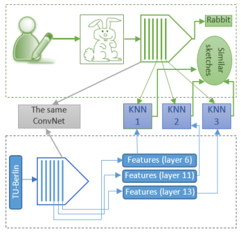
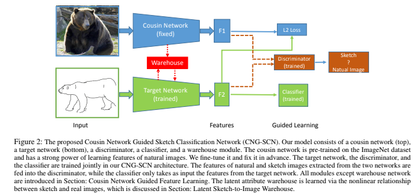

# Draw_Guess

## Table of Contents
1. [ToDo List](#todo-list)
2. [Env Setting](#env-setting)
3. [Data](#data)
4. [Usage](#usage)
5. [Related Work](#related-work)
6. [Methodology](#methodology)
7. [Evaluation](#evaluation)
8. [Reference](#reference)

## ToDo List

Requirement file is provided [here](https://docs.google.com/document/d/1olgVdN7WWXoFBzTxik3T2vjcWCKDIGKf1-pUFZ3PUxI/edit)

- [x] 2/18 Forming teams
- [x] 3/9 - 3/16 Project Check-in #1 
- [x] 3/18 Project Proposal
- [ ] 4/8 - 4/15 Project Check-in #2 
  - [x] main pipeline for classification
    - [x] Dataloader
    - [x] classification metrics
    - [x] vanilla classifier (ResNet)
  - [x] write interface using [Gradio](https://gradio.app/)
  - [x] field study of sketch recognition
  - [ ] brainstorm of methodology
  - [x] brainstorm of metrics
  - [ ] brainstorm of ethics
  - [ ] write up outlines
- [ ] 4/20 - 4/27 Project Check-in #3
- [ ] 5/2 - 5/9 Final Check in
- [ ] 5/11 Final Project Due
- [ ] 5/13 Deep Learning Day 2022


## Env Setting
**System**: Ubuntu 18.04 (Linux)

**GPU**: NVIDIA GeForce 3090 * 1

**PyTorch CUDA Toolkit**: 11.3
 
### Installation

Make sure Anaconda is installed.

```conda env create -f environment.yaml```


## Data

Download Sketchy Database from [here](https://sketchy.eye.gatech.edu/)


### Raw Data Structure:

```bash
├── 256x256
│   ├── photo
│   │   ├── tx_000000000000
|   |   |    ├── airplane
|   |   |    |    ├── n02691156_58.jpg
|   |   |    |    ├── n02691156_196.jpg
|   |   |    |    ├── ...
|   |   |    ├── alarm_clock
|   |   |    ├── ...
|   |   └── tx_000100000000
|   |   |    ├── ...
│   └── sketch
│       ├── tx_000000000000
|       |    ├── airplane
|       |    |    ├── n02691156_58-1.png
|       |    |    ├── n02691156_58-2.png
|       |    |    ├── n02691156_58-3.png
|       |    |    ├── n02691156_58-4.png
|       |    |    ├── n02691156_58-5.png
|       |    |    ├── n02691156_196-1.png
|       |    |    ├── ...
|       |    ├── ...
│       ├── tx_000000000010
|       |    ├── ...
│       ├── tx_000000000110
|       |    ├── ...
│       ├── tx_000000001010
|       |    ├── ...
│       ├── tx_000000001110
|       |    ├── ...
│       └── tx_000100000000
|            ├── ...
└── README.txt
```

### Sample: 1 image - 5 sketchs
<table>
  <tr>
    <td> </td>
    <td> </td>
   </tr> 
   <tr>
    <td></td>
      <td></td>
    </tr>
    <tr>
      <td></td>
      <td></td>
  
  </tr>
</table>

### Augmentations within 'photo'
<table border="1">
    <tr>
        <td> aug_id </td>
        <td> description </td>
    </tr>
    <tr>
        <td> tx_000000000000 </td>
        <td> image is non-uniformly scaled to 256x256 </td>
    </tr>
    <tr>
        <td> tx_000100000000 </td> 
        <td> image bounding box scaled to 256x256 with
                      an additional +10% on each edge; note 
                      that due to position within the image,
                      sometimes the object is not centered </td>
    </tr>
</table>

### Augmentations within 'sketch'
<table border="1">
    <tr>
        <td> aug_id </td>
        <td> description </td>
    </tr>
    <tr>
        <td> tx_000000000000 </td>
        <td> sketch canvas is rendered to 256x256
                      such that it undergoes the same
                      scaling as the paired photo </td>
    </tr>
    <tr>
        <td> tx_000000000010 </td> 
        <td> sketch is translated such that it is 
                      centered on the object bounding box </td>
    </tr>
    <tr>
        <td> tx_000000000110 </td> 
        <td> sketch is centered on bounding box and
                      is uniformly scaled such that one dimension
                      (x or y; whichever requires the least amount
                      of scaling) fits within the bounding box </td>
    </tr>
    <tr>
        <td> tx_000000001010 </td> 
        <td> sketch is centered on bounding box and
                      is uniformly scaled such that one dimension
                      (x or y; whichever requires the most amount
                      of scaling) fits within the bounding box </td>
    </tr>
    <tr>
        <td> tx_000000001110 </td> 
        <td> sketch is centered on bounding box and
                      is non-uniformly scaled such that it 
                      completely fits within the bounding box </td>
    </tr>
    <tr>
        <td> tx_000100000000 </td> 
        <td> sketch is centered and uniformly scaled 
                      such that its greatest dimension (x or y) 
                      fills 78% of the canvas (roughly the same
                      as in Eitz 2012 sketch data set) </td>
    </tr>

</table>

## Usage

### Preparation
1. set [environment](#env-setting)
2. download [data](#data)

### Activate Conda Env
```
cd path/to/this/repo
conda activate ./env
```

### Train/Test
```
python train.py [-h] --exp_yaml EXP_YAML 
  [--seed SEED] [--lr LR]
  [--input_dim INPUT_DIM] [--num_classes NUM_CLASSES]       
  [--batch_size BATCH_SIZE] [--train_base TRAIN_BASE]       
  [--root_dir ROOT_DIR] [--num_workers NUM_WORKERS]
  [--max_epochs MAX_EPOCHS] [--refresh_rate REFRESH_RATE]   
  [--log_dir LOG_DIR] [--exp_name EXP_NAME]
  [--model_name MODEL_NAME]
  [--val_check_interval VAL_CHECK_INTERVAL] [--topk TOPK]   
  [--resume_path RESUME_PATH] [--is_test]
  [--flip_bw FLIP_BW]
```

For details of the arguments, check [here](configs/args.py) and [here](configs/vanilla.yaml).

#### Training a vanilla model
```python train.py --exp_yaml configs/vanilla.yaml```

#### Testing a trained model
```python train.py ---exp_yaml configs/vanilla.yaml --resume_path path/to/your/ckpt --is_test```


### Check Logs

Faciliated by [Tensorboard](https://www.tensorflow.org/tensorboard).

#### Visualize vanilla model log
```tensorboard --logdir ./lightning_logs/resnet/version_??```

<image src="demo/log_train_loss_vanilla.png">

### Interface

Faciliated by [Gradio](https://gradio.app).

The same configuration as [train/test](#traintest).

#### A sketchpad for the vanilla model
```python vis.py --exp_yaml configs/vanilla.yaml --resume_path path/to/your/ckpt```

<image src="demo/interface.png">

## Related Work 

The task we want to solve is free-hand full-sketch image-based sketch recognition. i.e. We assume no stroke sequence information will be provided, and the only input we have will be a picture. Thus, we analyze four works tackling the same task [\[4, 5, 6, 7\]](#reference).
<table>
  <tr>
    <td> Method </td>
    <td> Description </td>
  </tr>
  <tr>
    <td> [4] SketchNet </td>
    <td></td>
  </tr>
  <tr>
    <td> [5] Deepsketch </td>
    <td></td>
  </tr>
  <tr>
    <td> [6] CNG-SCN </td>
    <td></td>
  </tr>
  <tr>
    <td> [7] Hybrid CNN </td>
    <td></td>
  </tr>
</table>

### summary

- [4], [6]: make use of natural images
- [4], [5], [6]: similarities; could between natural images and sketches, or within sketches
- [7]: make use of shape clue
- [6], [7]: side tasks, extra supervision
- [4], [5]: retrieval-based recognition

## Methodology

```hint: CLIP-based ``` 
```hint: flip 1/0 - black/white might help? currently activation is blank```

## Evaluation

### data
quantitative: 
- set aside all *-5.png as test set.

qualitative: 
- above test set visualization
- (optional) human input window


### metrics
<table border="1">
  <tr>
    <td>Accuracies[%]</td>
    <td>rank-1</td>
    <td>rank-2</td>
    <td>rank-3</td>
    <td>rank-4</td>
    <td>rank-5</td>
  </tr>

</table>


## Reference

[1] Xu, P, Hospedales, TM, Yin, Q, Song, Y-Z, Xiang, T & Wang, L 2022, 'Deep Learning for Free-Hand Sketch: A Survey', IEEE Transactions on Pattern Analysis and Machine Intelligence.

[2] P. Sangkloy, N. Burnell, C. Ham, and J. Hays. The Sketchy Database: Learning to Retrieve Badly Drawn Bunnies. ACM Trans. Graph., 35(4):119:1–119:12, July 2016.

[3] Q. Yu, Y. Yang, F. Liu, Y.-Z. Song, T. Xiang, and T. M. Hospedales, “Sketch-a-net: A deep neural network that beats humans,” IJCV, 2017

[4] H. Zhang, S. Liu, C. Zhang, W. Ren, R. Wang, and X. Cao,
“Sketchnet: Sketch classification with web images,” in CVPR,
2016.

[5] O. Seddati, S. Dupont, and S. Mahmoudi, “Deepsketch: deep convolutional neural networks for sketch recognition and similarity search,” in CBMI, 2015.

[6] K. Zhang, W. Luo, L. Ma, and H. Li, “Cousin network guided
sketch recognition via latent attribute warehouse,” in AAAI, 2019.

[7] X. Zhang, Y. Huang, Q. Zou, Y. Pei, R. Zhang, and S. Wang,
“A hybrid convolutional neural network for sketch recognition,”
PRL, 2020

[8] A. Prabhu, V. Batchu, S. A. Munagala, R. Gajawada, and A. Namboodiri, “Distribution-aware binarization of neural networks for sketch recognition,” in WACV, 2018.